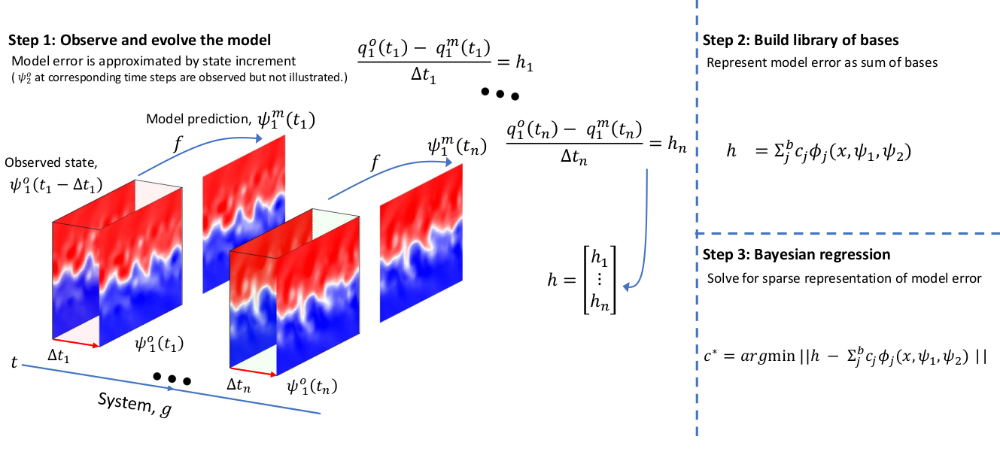
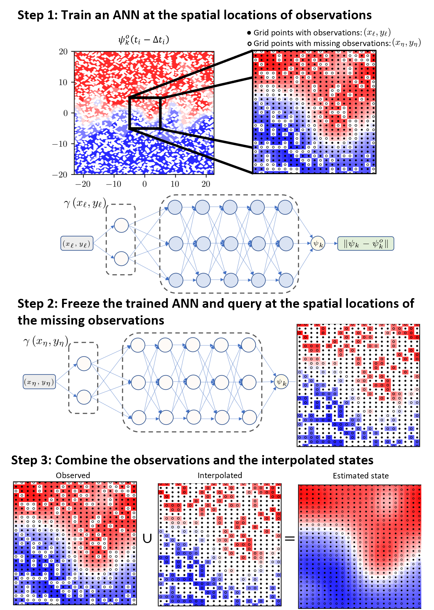

# MEDIDA for QG

#### [[project website]](http://pedram.rice.edu/team/)



## Table of contents
* [Introduction](#Introduction)
* [Requirements](#Requirements)
* [Experiments](#Experiments)
    * [Case 1](#Case-1)
* [Citation](#Citation)
* [References](#References)

## Introduction
Key points
<ul>
<li>Model error discovery with interpretability and data assimilation (<a href="https://github.com/envfluids/MEDIDA">MEDIDA</a>)[1]* is scaled
up to geostrophic turbulence and sparse observations</li>
<li>Naive use of neural nets (NNs) as interpolator does not capture small scales due to
spectral bias, failing discoveries of closed-form errors</li>
<li>Reducing this bias using random Fourier features enables NNs to represent the full
range of scales, leading to successful error discoveries</li>
</ul>

## Requirements
<!-- These are examples,
	add or remove as appropriate -->

- python 3.6
	- [scipy](https://pypi.org/project/scipy/)
	- [numpy](https://pypi.org/project/numpy/)
- [Pytroch](https://pytorch.org/docs/1.11/)
- [RFF in Pytroch](https://github.com/jmclong/random-fourier-features-pytorch)

## Experiments
### Case 1
Case 1 is disscused here [Case 1 Location](./experiments/QG) 


Python code

```bash
will be updated
```

## Citation
- [Mojgani, R.](https://www.rmojgani.com), [Chattopadhyay, A.](https://scholar.google.com/citations?user=wtHkCRIAAAAJ&hl=en), and [Hassanzadeh, P.
](https://scholar.google.com/citations?user=o3_eO6EAAAAJ&hl=en),
[**Interpretable structural model error discovery from sparse assimilation increments using spectral bias-reduced neural networks: A quasi-geostrophic turbulence test case**](https://doi.org/10.1029/2023MS004033), (2023).([url]([https://doi.org/10.1029/2023MS004033](https://doi.org/10.1029/2023MS004033)))<details><summary>BibTeX</summary><pre>@article{Mojgani_JAMES_2023,
author = {Mojgani, Rambod and Chattopadhyay, Ashesh and Hassanzadeh, Pedram},
title = {Interpretable Structural Model Error Discovery From Sparse Assimilation Increments Using Spectral Bias-Reduced Neural Networks: {A} Quasi-Geostrophic Turbulence Test Case},
journal = {Journal of Advances in Modeling Earth Systems},
volume = {16},
number = {3},
pages = {e2023MS004033},
keywords = {model error, spectral bias, data assimilation, interpolation, neural network, bias},
doi = {https://doi.org/10.1029/2023MS004033},
note = {e2023MS004033 2023MS004033},
year = {2024}
}</pre></details>

## References

- \[1\] [Mojgani, R.](https://www.rmojgani.com), [Chattopadhyay, A.](https://scholar.google.com/citations?user=wtHkCRIAAAAJ&hl=en), and [Hassanzadeh, P.
](https://scholar.google.com/citations?user=o3_eO6EAAAAJ&hl=en),
[**Closed-form discovery of structural errors in models of chaotic systems by integrating Bayesian sparse regression and data assimilation.**](https://doi.org/10.1063/5.0091282), Chaos 32, 061105 (2022) 
arXiv:2110.00546.
([Download](https://aip.scitation.org/doi/pdf/10.1063/5.0091282))<details><summary>BibTeX</summary><pre>
@article{Mojgani_Chaos_2022,
author = {Mojgani,Rambod  and Chattopadhyay,Ashesh  and Hassanzadeh,Pedram },
title = {Discovery of interpretable structural model errors by combining {B}ayesian sparse regression and data assimilation: {A} chaotic {K}uramoto–{S}ivashinsky test case},
journal = {Chaos: {A}n Interdisciplinary Journal of Nonlinear Science},
volume = {32},
number = {6},
pages = {061105},
year = {2022},
doi = {10.1063/5.0091282},
URL = {https://doi.org/10.1063/5.0091282 },
eprint = {arXiv:2110.00546}
}</pre></details>
